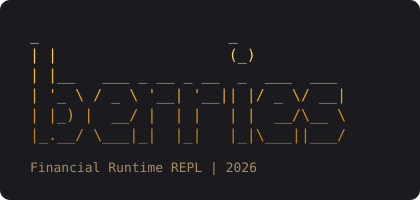

<p align="center">
  
</p>

<p align="center">
  <em>A little language for financial computation, grown in Go.</em>
</p>

<p align="center">
  
  
  
</p>

---

**berries** is an interpreted programming language being built from scratch in Go: lexer, Pratt parser, AST, and evaluator, all handwritten, no parser generators. The long-term goal is a small, pleasant language for **financial computation**: money that never touches floating point, first-class rates and percentages, and built-ins for the math finance people actually do (interest, amortization, NPV, IRR).

It's early days. Right now berries is a solid general-purpose interpreter core; the financial layer comes next.

## A taste

Fire up the REPL and berries greets you in gold:

```text
 _                     _
| |                   (_)
| |__   ___ _ __ _ __  _  ___  ___
| '_ \ / _ \ '__| '__|| |/ _ \/ __|
| |_) |  __/ |  | |   | |  __/\__ \
|_.__/ \___|_|  |_|   |_|\___||___/
Financial Runtime REPL | 2026

b> 5 + 5 * 2
15
b> (10 > 5) == true
true
b> if (200 - 50 > 100) { 1 } else { 0 }
1
b> !!true
true
```

And a sketch of where it's headed — this syntax **doesn't run yet**, it's the north star:

```text
b> let principal = $12,500.00
b> let rate = 4.5%
b> principal * rate
$562.50
b> npv(8%, [-1000, 400, 400, 400])
$30.83
```

## Getting started

You need Go 1.26+. Then:

```sh
# start the REPL
go run main.go

# run the test suite
go test ./...
```

## Status

The interpreter is being grown feature by feature, each with tests.

**Working today**

- [x] Lexer and token stream
- [x] Pratt parser producing a full AST
- [x] Integer and boolean expressions
- [x] Prefix operators (`!`, `-`) and infix operators (`+ - * / == != < >`)
- [x] Grouped expressions
- [x] `if` / `else` conditionals
- [x] `return` statements

**Parsed, not yet evaluated**

- [x] `let` bindings and identifiers
- [x] Function literals and call expressions

**Up next**

- [x] Environments, bindings, and closures
- [ ] Proper error objects and messages
- [ ] Strings, arrays, and hashes
- [ ] Built-in functions

**The financial core (the whole point)**

- [ ] Arbitrary-precision decimal numbers — money never touches a `float64`
- [ ] Money literals with currency (`$12,500.00`)
- [ ] Percentage and rate types (`4.5%`)
- [ ] Dates, periods, and day-count conventions
- [ ] Finance built-ins: `npv`, `irr`, `amortize`, compound interest, and friends

## How it works

berries is a classic tree-walking interpreter, built in clearly separated stages:

```text
source ──▶ lexer ──▶ tokens ──▶ parser ──▶ AST ──▶ evaluator ──▶ objects
```

| Package     | What it does                                                 |
| ----------- | ------------------------------------------------------------ |
| `token`     | Token types the lexer emits                                  |
| `lexer`     | Turns raw source into a token stream                         |
| `ast`       | Node types for every statement and expression                |
| `parser`    | Pratt (top-down operator precedence) parser building the AST |
| `object`    | The runtime value system: integers, booleans, null, returns  |
| `evaluator` | Walks the AST and computes results                           |
| `repl`      | The interactive read–eval–print loop, banner included        |

## Acknowledgments

The interpreter core follows the approach of Thorsten Ball's *Writing An Interpreter In Go*; berries starts from that foundation and grows toward financial computation.
